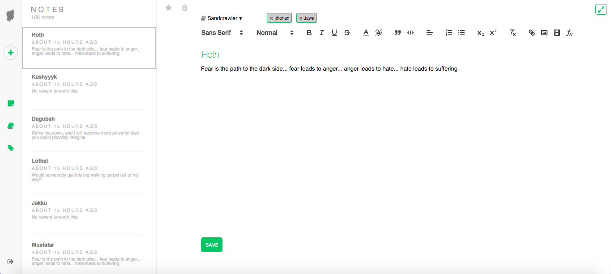
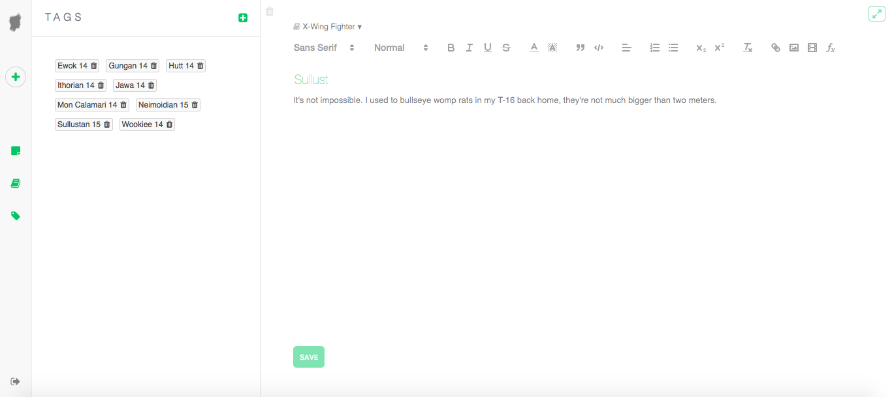
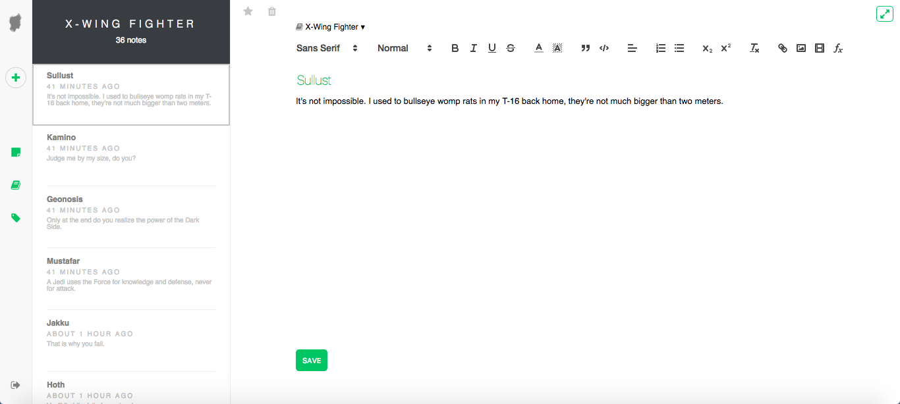

# Trevornote App

[View on Heroku](https://trevornote.herokuapp.com/#/)

This repository contains the Trevornote app, a single-page Evernote clone which enables users to create, edit, and organize rich-text notes. Notes can be formatted with styling options, images, and code blocks, and can also be tagged or added to notebooks.

## Technologies

The Trevornote backend was written in Ruby riding on Rails. The database implemented was PostgreSQL. The frontend was written in JavaScript, utilizing React in conjunction with Redux to construct and intuitive user interface.

## Features

The primary features of Trevornote are notes, notebooks, and tags. All of these are broken down into sensible and intuitive React components. With notes being the primary feature of the app, the notes container served as a logic center for determining which overlays and sidebars to display. This is demonstrated in componentWillReceiveProps:

```javascript
componentWillReceiveProps(nextProps) {
  this.notebookOverlay = false;
  this.notebookSidebar = false;
  this.noteSidebar = false;
  this.tagOverlay = false;
  this.tagSidebar = false;

  if (nextProps.match.path === "/notes") {
    this.noteSidebar = true;
  } else if (nextProps.match.path === "/notes/:noteId") {
    if (this.props.match.params.noteId !== nextProps.match.params.noteId) {
      this.props.fetchNote(nextProps.match.params.noteId);
    }
    this.noteSidebar = true;
  } else if (nextProps.match.path === "/notebooks") {
    this.notebookOverlay = true;
  } else if (nextProps.match.path === "/notebooks/:notebookId") {
    if (this.props.match.params.notebookId !== nextProps.match.params.notebookId) {
      this.props.fetchNotebook(nextProps.match.params.notebookId);
      this.props.fetchNotesByNotebook(nextProps.match.params.notebookId);
    }
    this.notebookSidebar = true;
  } else if (nextProps.match.path === "/notebooks/:notebookId/notes/:noteId") {
    if (this.props.match.params.noteId !== nextProps.match.params.noteId) {
      this.props.fetchNote(nextProps.match.params.noteId);
    }
    this.notebookSidebar = true;
  } else if (nextProps.match.path === "/tags") {
    this.tagOverlay = true;
  } else if (nextProps.match.path === "/tags/:tagId") {
    if (this.props.match.params.tagId !== nextProps.match.params.tagId) {
      this.props.fetchTag(nextProps.match.params.tagId);
      this.props.fetchNotesByTag(nextProps.match.params.tagId);
    }
    this.tagSidebar = true;
  } else if (nextProps.match.path === "/tags/:tagId/notes/:noteId") {
    if (this.props.match.params.noteId !== nextProps.match.params.noteId) {
      this.props.fetchNote(nextProps.match.params.noteId);
    }
    this.tagSidebar = true;
  }
}
```

The result was a simple user interface where users were presented with their notes, and could simply click on the title or note body to begin editing.



At any point, users can click the navigation buttons to open a sidebar and filter notes by notebook or tag name.





Since each sidebar has similar note summaries and themes, React components could be reused for each parent component with differences passed down as props. A good example of this is a NoteSummaryItem, a mapped component which provides a clickable summary of each note:

```javascript
this.state.notes.map(note => (
  <NoteSummaryItem
    key={note.id}
    type={`notebooks/${this.state.currentNotebook.id}/notes`}
    note={note}
    deleteNote={this.props.deleteNote}
    currentNote={this.props.currentNote.id == note.id} />
  ))
```

Any user action, such as creating or deleting an item, dispatches an action which affects the state. Accordingly, each component is re-rendered with the updated state, providing a dynamic interface where users can immediately see the effects of their actions. This is true even with modal components, utilized when users add a new notebook or tag.

## Future Work

Moving forward, Trevornote will be given a variety of features. These include autosave, shortcuts, live chat, and implementation of animate.js for a smoother animation experience.
